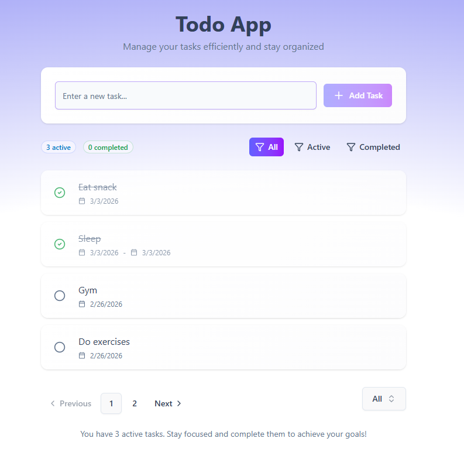

# 📝 Todo App

Một ứng dụng quản lý công việc (Todo App) Full-stack hiện đại, giúp người dùng dễ dàng theo dõi và tổ chức các công việc hằng ngày với giao diện trực quan, mượt mà.

## 🚀 Công Nghệ Sử Dụng

🔸**Frontend:** React

🔸**UI/Styling:** Tailwind CSS 4, Shadcn UI

🔸**Backend:** Node.js (Express.js)

🔸**Database:** MongoDB

## ✨ Tính Năng Nổi Bật

🔴 Thêm, chỉnh sửa và xóa công việc (CRUD operations).

🔴 Đánh dấu trạng thái công việc (đang chờ, đã hoàn thành).

🔴 Giao diện tối giản, hiện đại và hoàn toàn tương thích với nhiều kích thước màn hình (Responsive Design).

🔴 Lưu trữ dữ liệu an toàn và liền mạch với cơ sở dữ liệu NoSQL.

## 🛠️ Hướng Dẫn Cài Đặt (Local Development)

### Yêu cầu hệ thống:
✨ Node.js đã được cài đặt.

✨ Có sẵn MongoDB chạy cục bộ (Local) hoặc tài khoản MongoDB Atlas.

### Các bước khởi chạy dự án:

**🌟1. Clone repository về máy:**
```bash
git clone [https://github.com/DT-MinhMan/todo-app.git](https://github.com/DT-MinhMan/todo-app.git)
cd todo-app
```
**🌟2. Cài đặt các gói phụ thuộc (Dependencies):** Bạn cần cài đặt thư viện cho cả backend và frontend.


#### 👉 Cài đặt cho Backend (thư mục gốc)
```Bash
npm install
```
#### 👉 Di chuyển vào thư mục frontend và cài đặt
```
cd client (hoặc thư mục frontend của bạn)
npm install
```
**🌟3. Cấu hình biến môi trường:**
Tạo một file .env ở thư mục backend và cung cấp các thông tin sau:

Đoạn mã: 
```
MONGODB_CONNECTIONSTRING = your_mongodb_connection_string
PORT = 5001
NODE_ENV = "production" 
```
**🌟4. Chạy ứng dụng:**

### 🟠 Nếu là dev: sửa NODE_ENV = "dev"
#### 👉 Khởi chạy Backend (từ thư mục gốc)
```
npm run dev
```
#### 👉 Khởi chạy Frontend (từ thư mục frontend)
```
npm run dev
```
### 🟠 Nếu là người dùng: chạy ở folder lưu trữ frontend và backend

```
npm run build
npm run start 
```

📸 Hình ảnh dự án (Screenshots)


 ## 🌟 Bạn có thể xem view của ứng dụng tại đây:
https://todoapp-pnfg.onrender.com
